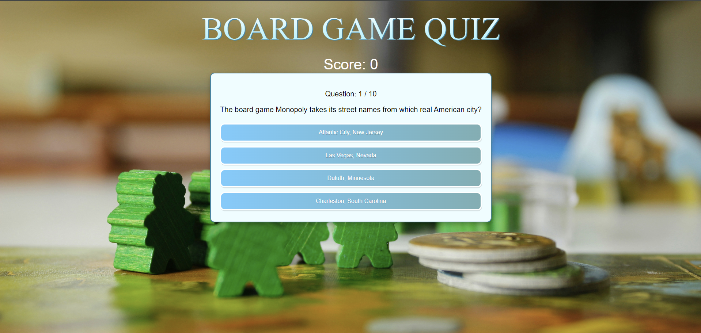
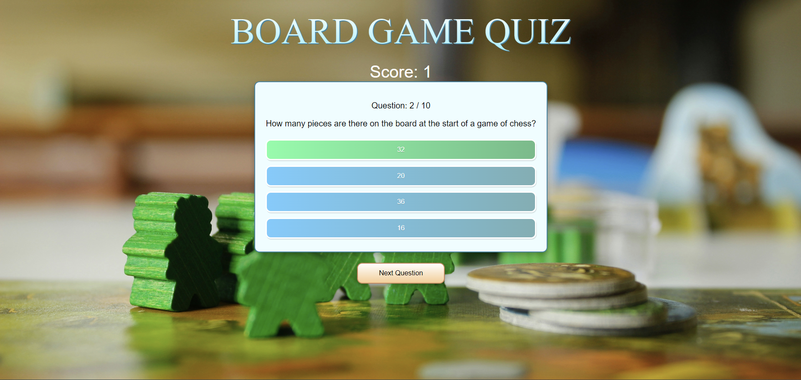
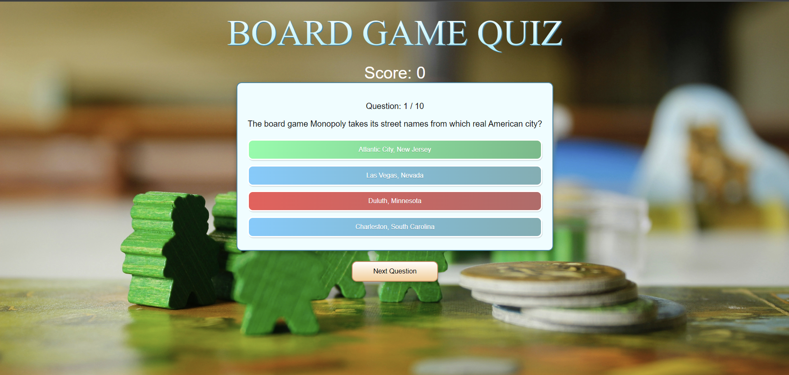

# BoardGame Quiz 🎲

A fun and interactive quiz app designed to test your knowledge of board games. Built with React and TypeScript, this project marks my first venture into TypeScript development.

---

## Table of Contents

- [Live Demo](#live-demo)
- [Features](#features)
- [Data Source](#data-source)
- [What I Learned](#what-i-learned)
- [Tech Stack](#tech-stack)
- [Screenshots](#screenshots)

---

## Live Demo

Experience the quiz here: [BoardGame Quiz](https://spinksboardgamequiz.netlify.app/)

---

## Features

- **Multiple Choice Questions**: Engage with a variety of board game-related questions.
- **Score Tracking**: Keep track of your score as you progress through the quiz.
- **Responsive Design**: Enjoy a seamless experience across devices.

---

## Data Source

- Quiz questions are fetched dynamically from an **external trivia API**.  
- Questions are focused on the **board games category**, with multiple-choice options and varying difficulty levels.

---

## What I Learned

Embarking on this project was my introduction to TypeScript, and it significantly enhanced my development skills:

- ✅ Gained proficiency in **TypeScript syntax** and **type annotations**.
- ✅ Implemented **React functional components** with hooks.
- ✅ Managed **state** using React's `useState` and `useEffect` hooks.
- ✅ Utilized **TypeScript interfaces** to define component props and state.
- ✅ Fetched and handled **external API data** dynamically.
- ✅ Improved debugging and code quality through **static typing**.
- ✅ Enhanced understanding of **ES6+ features** and **modern JavaScript** practices.

---

## Tech Stack

- **Frontend**: React, TypeScript, CSS
- **API**: External trivia API (Board Games category)
- **Hosting / Deployment**: Netlify

---

## Screenshots

- **Quiz Interface**  
  

- **Question Right**  
  

- **Question Wrong**  
  

---

